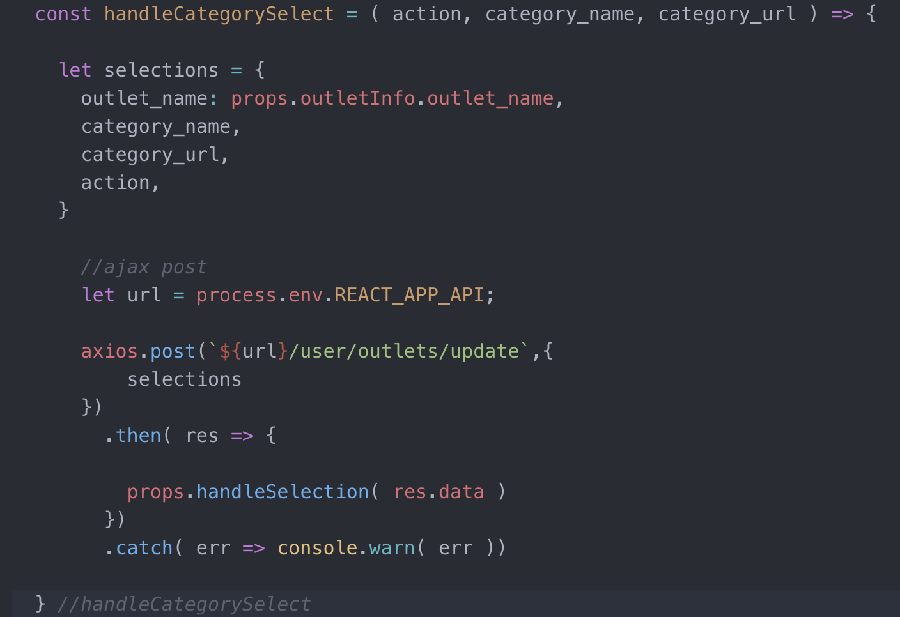

# Slug - A news aggregation platform

## Purpose of the site

I'm sure you're familiar with news aggregation sites, this is no different. An application that pulls together news from a variety of sources and categories, and allows users to customise their news reading experience.

I always wanted an application that would make staying up to date with the blogs I follow easier. So with my new skills, I thought 'why not to build my own'.

## Features

* Select news outlets to subscribe to
* Select categories from those outlets to further Customise your feed
* Toggle which outlets and categories are displayed
* Dynamic dashboard further to customise your feed

## Style

* Simple
* Organised
* Easy to use

## Tech / Framework Used

* React.js
* Node.js
* Mongodb (atlas)
* Mongoose
* Express
* rss-parser
* cheerio
* request
* JWT tokens
* CSS
* Heroku

## Link to Live Site

https://jaytees.github.io/frontend-slug/#/

## Link to the Backend Repo

https://github.com/jaytees/backend-slug

## Wins

* How DRY I managed to make the rendering of the feed data. My aim was to have all outlets handled by one component. I achieved this through refactoring how the data was stored on the backend (noSql was a perfect choice for this reason). As well as, creating a function that parsed the user preference data, into a format specifically for the frontend. Although this added an extra step and an extra piece of state. It was more efficient than having to loop through multiple levels of the nested preferences object, multiple times.
* I'm really happy with how centrally state is handled. This was one of my goals from the start and I got very close to only having state in the top level component.
* My first time using environment variables and by defining the API endpoint under the same name in production and development was able to dry all my AJAX request to just reference this one variable.

## Challenges

* Following on from above to get to that level of satisfaction, took a lot of thought, planning and refactoring. As I mentioned in the experience section of this README, I learnt a valuable lesson..."Don't try to refactor code you haven't written". What i mean by this is, I had a clear vision from the offset and knew there was a very clean way to execute this code but due to the volume of data I was handling, it was easy to get lost in how it was being passed around the application, before even attempting it.

## Code

* Refactoring the way AJAX requests are made depending on environment. Required refactoring both the front and back-end. On the front-end making use of environment variables. So I could use one environment for reference for both production and development.

* When making the decision on how to handle the category selection I took into consideration the efficiency and UX of my options. In the end deciding to make an AJAX request on every selection, in favour of keeping the majority of my state in the top level component and a the UX reflecting immediate changes.
* I achieved this by passing a click handler down from the top level component, which passed back up the AJAX response, prompting a re-render of the navbar.

* Following on from above, this prompted me to refactor into a function, how the raw preference data from the backend was parsed into a format for the frontend feed component.

## Screenshots

* Landing Page

* Profile Set-Up

* Dashboard View

* Profile View

## Experience

* I approached this project with a lot more consideration for the underlying architecture than any of my previous projects.
* My goal was to deliver a project where the code looked as good as the design.
* It was a necessary decision as this project was heavily reliant on data from a variety of sources, in different formats and how it was then consolidated to be rendered consistently.
* It was a great challenge and I learnt a lot about parsing data from AJAX requests along the way. I also learnt that it is counter-productive to try and refactor code before you have even written it.

* At the start of this project I had very little experience with Mongodb and Express. But I really wanted to push myself to learn another database structure and framework.
* Learning Mongo and Express from the ground up while trying to deliver a project was stressful but a great experience and I learnt so much. It was like my first project again, every little bit of functionality was a massive win.

## Things to do

* Add more styling
  * Different viewing styles for the dashboard
  * A dark mode
* A dashboard that you can resize and rearrange as you want
* Refactor how outlet images are rendered and stored
* Add default image for missing images

## Known bugs

* The feed images are squashed on the first render
